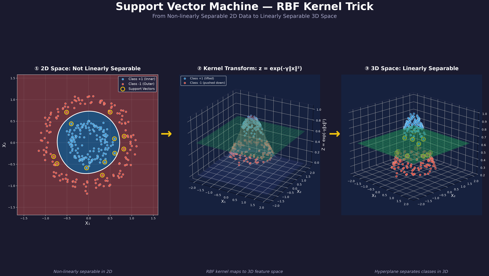

# SVM Kernel Trick 3D Visualization

An interactive visualization demonstrating the **Support Vector Machine (SVM) Kernel Trick** — showing how non-linearly separable 2D data becomes linearly separable in 3D feature space using the RBF (Radial Basis Function) kernel.



## Overview

This project visualizes the core concept of the SVM kernel trick:

1. **2D Space**: Concentric circle data (blue inner, red outer) that cannot be separated by a straight line
2. **Kernel Transform**: The RBF kernel `z = exp(-γ‖x‖²)` maps data into 3D — lifting center points up and pushing outer points down
3. **3D Space**: A horizontal hyperplane can now cleanly separate the two classes

## Features

- **2D Decision Boundary**: Visualize the SVM's circular decision boundary in the original 2D space
- **3D Kernel Transform**: See how data points are lifted into 3D feature space (static matplotlib + interactive Plotly)
- **Transform Animation**: Watch the gradual 2D→3D transformation as an animated GIF
- **Interactive Controls**: Adjust parameters in real-time via Streamlit sidebar
  - Number of samples
  - Noise level
  - γ (Gamma) — controls RBF kernel width
  - C (Regularization) — controls SVM margin

## Installation

```bash
pip install -r requirements.txt
```

### Dependencies

- `numpy` — numerical computation
- `scikit-learn` — SVM training and data generation
- `matplotlib` — 2D/3D static plots and animation
- `scipy` — scientific computation
- `streamlit` — interactive web application
- `plotly` — interactive 3D visualization

## Usage

Launch the Streamlit app:

```bash
streamlit run app.py
```

The app will open in your browser at `http://localhost:8501`.

### Tabs

| Tab | Description |
|-----|-------------|
| **2D Decision Boundary** | Original 2D data with SVM decision boundary contours and support vector markers |
| **3D Kernel Transform** | Matplotlib static 3D plot + interactive Plotly 3D chart (rotate/zoom with mouse) |
| **Transform Animation** | Animated GIF showing the step-by-step 2D→3D kernel transformation |

## Project Structure

```
nchu-0618-support-vector-machine/
├── app.py               # Streamlit interactive application (3 tabs)
├── svm_utils.py         # Core utilities: data generation, RBF transform, SVM training
├── generate_poster.py   # Script to generate the poster image
├── poster.png           # Generated poster
├── requirements.txt     # Python dependencies
└── README.md            # This file
```

## Technical Details

### RBF Kernel Transform

The RBF (Gaussian) kernel implicitly maps 2D input `(x₁, x₂)` to a higher-dimensional feature space. For visualization, we use the explicit feature map:

```
z = exp(-γ · (x₁² + x₂²))
```

- Points near the origin (inner class) → `z ≈ 1` (lifted high)
- Points far from origin (outer class) → `z ≈ 0` (pushed down)

This creates a "hill" in 3D space where the two classes become separable by a horizontal hyperplane.

### SVM Training

The SVM is trained using scikit-learn's `SVC(kernel='rbf')`, which internally uses the kernel trick without explicitly computing the 3D coordinates. The decision boundary is computed via `model.decision_function()`.

## Poster Generation

Generate the poster image:

```bash
python generate_poster.py
```

This creates `poster.png` — a dark-themed infographic showing the 2D→3D kernel trick pipeline.

## License

MIT
